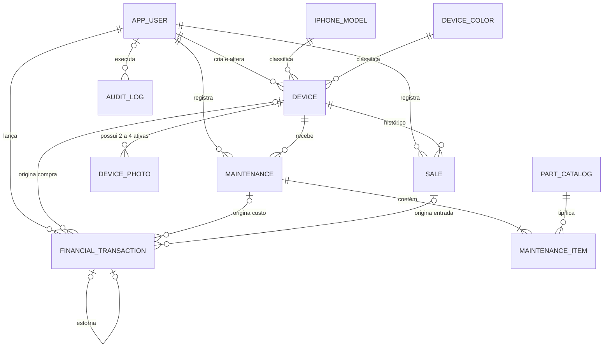

# Sprint 1 — Etapa B: PostgreSQL e Diagrama ER

Versão: **1.0 aprovada**  
Status: **aprovada em 03/09/2026, com ajustes incorporados**  
Dependência: **Etapa A 1.0 aprovada**  
DDL de referência: `schema-v1-proposal.sql`

## 1. Resultado da etapa

O domínio aprovado foi convertido em um modelo lógico PostgreSQL com:

- 11 tabelas em terceira forma normal;
- UUID como chave primária;
- código sequencial amigável para aparelho;
- `NUMERIC(14,2)` para dinheiro;
- `TIMESTAMPTZ(6)` para datas e horas;
- enums persistidos como `VARCHAR` com `CHECK`;
- FKs com exclusão e atualização restritas;
- índices parciais para registros ativos;
- ledger imutável com estornos;
- auditoria imutável;
- constraints diferíveis para invariantes que atravessam tabelas.

Esta etapa não contém classes JPA nem a migration Flyway definitiva. O SQL entregue é a referência revisável que será convertido em `V1__initial_schema.sql` somente depois da aprovação.

## 2. Convenções PostgreSQL

| Tema | Decisão |
| --- | --- |
| Nomes | `snake_case`, singular e em inglês. |
| PK | `uuid DEFAULT gen_random_uuid()`; PostgreSQL 15+ e `pgcrypto` explicitamente habilitado na migration. |
| Código visível | `device.internal_code`, no formato `IPH-000001`. |
| Dinheiro | `numeric(14,2)`, com limite de até 12 dígitos inteiros. |
| Instantes | `timestamptz(6)`; backend trabalha em UTC. |
| Booleanos | `boolean NOT NULL`, evitando estado desconhecido. |
| Enums | `varchar` + `CHECK`, evitando o acoplamento de tipos ENUM nativos a migrations futuras. |
| Concorrência | `version bigint` nas entidades mutáveis. |
| Texto livre | Limites explícitos; `btrim(...) <> ''` quando obrigatório. |
| JSON | Somente `audit_log.changes`, pois seu formato varia conforme a entidade auditada. |

`gen_random_uuid()` é o default oficial do banco. A migration executa `CREATE EXTENSION IF NOT EXISTS pgcrypto` e o ambiente deve permitir essa criação ou disponibilizar a extensão previamente. O projeto assume PostgreSQL 15 ou superior. O Hibernate usa `GenerationType.UUID` nas escritas JPA, enquanto o default do banco protege inserções SQL e integrações fora do ORM; ambos geram UUID v4 compatível.

## 3. Diagrama ER



Observações importantes:

- `Device` pode ter várias vendas históricas, mas um índice parcial permite no máximo uma `ACTIVE`.
- uma transação financeira aponta para no máximo uma origem: aparelho, manutenção ou venda;
- saldo inicial, aporte, retirada e ajuste não possuem origem operacional;
- `AuditLog.entityId` é uma referência lógica, não uma FK polimórfica.

## 4. Modelo lógico

### 4.1 `app_user`

| Coluna | Tipo | Nulo | Regra |
| --- | --- | --- | --- |
| `id` | `uuid` | Não | PK. |
| `name` | `varchar(120)` | Não | Nome de exibição não vazio. |
| `username` | `varchar(50)` | Não | Único, minúsculo e com formato controlado. |
| `password_hash` | `varchar(255)` | Não | Hash não vazio. |
| `role` | `varchar(20)` | Não | Somente `SOCIO`. |
| `active` | `boolean` | Não | Default `true`. |
| `created_at`, `updated_at` | `timestamptz(6)` | Não | Metadados temporais. |
| `created_by`, `updated_by` | `uuid` | Sim | Auto-FKs; nulos apenas em bootstrap controlado. |
| `version` | `bigint` | Não | Concorrência otimista. |

Não existe hard delete de usuário. Desativação preserva todas as FKs históricas.

### 4.2 `iphone_model`

| Coluna | Tipo | Nulo | Regra |
| --- | --- | --- | --- |
| `id` | `uuid` | Não | PK. |
| `code` | `varchar(60)` | Não | Único, maiúsculo e imutável por regra de aplicação. |
| `name` | `varchar(100)` | Não | Único sem diferenciar maiúsculas/minúsculas. |
| `active` | `boolean` | Não | Controla disponibilidade no cadastro. |
| `display_order` | `integer` | Não | Maior ou igual a zero. |
| metadados | — | — | Criação, atualização, autores e versão. |

### 4.3 `device_color`

| Coluna | Tipo | Nulo | Regra |
| --- | --- | --- | --- |
| `id` | `uuid` | Não | PK. |
| `code` | `varchar(50)` | Não | Código único normalizado. |
| `name` | `varchar(80)` | Não | Nome único sem diferenciar caixa. |
| `active` | `boolean` | Não | Desativação sem afetar histórico. |
| metadados | — | — | Criação, atualização, autores e versão. |

### 4.4 `part_catalog`

| Coluna | Tipo | Nulo | Regra |
| --- | --- | --- | --- |
| `id` | `uuid` | Não | PK. |
| `code` | `varchar(50)` | Não | Código único; inclui `OTHER`. |
| `name` | `varchar(100)` | Não | Nome único sem diferenciar caixa. |
| `active` | `boolean` | Não | Apenas peças ativas entram em novos itens. |
| metadados | — | — | Criação, atualização, autores e versão. |

### 4.5 `device`

| Coluna | Tipo | Nulo | Regra |
| --- | --- | --- | --- |
| `id` | `uuid` | Não | PK. |
| `internal_code` | `varchar(24)` | Não | Único; gerado por sequence no padrão `IPH-000001`. |
| `model_id` | `uuid` | Não | FK para modelo. |
| `color_id` | `uuid` | Não | FK para cor. |
| `storage_gb` | `integer` | Não | Apenas `64`, `128`, `256`, `512`, `1024` ou `2048` GB. |
| `purchase_price` | `numeric(14,2)` | Não | Estritamente positivo, conforme aprovação. |
| `purchased_at` | `timestamptz(6)` | Não | Data econômica da compra. |
| `face_id_working` | `boolean` | Não | Obrigatório. |
| `original_screen` | `boolean` | Não | Obrigatório. |
| `original_battery` | `boolean` | Não | Obrigatório. |
| `battery_health_percent` | `integer` | Não | Entre 0 e 100; `0` significa valor indisponível/não aferido, não saúde real de 0%. |
| `status` | `varchar(32)` | Não | Um dos três estados aprovados. |
| `archived_at`, `archived_by` | timestamp/UUID | Sim | Ambos nulos ou ambos preenchidos. |
| metadados | — | — | Criação, atualização, autores e versão. |

Arquivamento é terminal no MVP. Antes de arquivar, compras devem ser estornadas e não pode existir manutenção ou venda ativa. Arquivamento não representa perda, descarte ou venda externa; esses fluxos permanecem fora do MVP.

### 4.6 `device_photo`

| Coluna | Tipo | Nulo | Regra |
| --- | --- | --- | --- |
| `id` | `uuid` | Não | PK. |
| `device_id` | `uuid` | Não | FK para aparelho. |
| `storage_key` | `varchar(512)` | Não | Único; chave do objeto no storage. |
| `original_filename` | `varchar(255)` | Não | Referência de upload. |
| `mime_type` | `varchar(100)` | Não | Tipo validado também no backend. |
| `size_bytes` | `bigint` | Não | Estritamente positivo. |
| `position` | `integer` | Não | Entre 1 e 4. |
| `removed_at` | `timestamptz(6)` | Sim | Remoção lógica. |
| `created_at`, `created_by` | timestamp/UUID | Não | Auditoria de inclusão. |

Um índice parcial único impede duas fotos ativas na mesma posição. Como as únicas posições possíveis são 1–4, também impede mais de quatro fotos ativas. A migration declara explicitamente uma constraint trigger `DEFERRABLE INITIALLY DEFERRED` que exige no mínimo duas no fim da transação.

### 4.7 `maintenance`

| Coluna | Tipo | Nulo | Regra |
| --- | --- | --- | --- |
| `id` | `uuid` | Não | PK. |
| `device_id` | `uuid` | Não | FK para aparelho não vendido e não arquivado. |
| `performed_at` | `timestamptz(6)` | Não | Igual ou posterior à compra. |
| `responsible_user_id` | `uuid` | Não | Usuário responsável. |
| `status` | `varchar(20)` | Não | `ACTIVE` ou `CANCELLED`. |
| `cancelled_at`, `cancelled_by`, `cancellation_reason` | timestamp/UUID/texto | Condicional | Todos obrigatórios no cancelamento. |
| metadados | — | — | Criação, atualização, autores e versão. |

Manutenção confirmada é imutável. Uma correção cancela o conjunto inteiro e registra outro. Isso evita alterar silenciosamente custo já refletido no caixa.

### 4.8 `maintenance_item`

| Coluna | Tipo | Nulo | Regra |
| --- | --- | --- | --- |
| `id` | `uuid` | Não | PK. |
| `maintenance_id` | `uuid` | Não | FK para cabeçalho. |
| `part_id` | `uuid` | Não | FK para catálogo. |
| `details` | `varchar(255)` | Sim | Obrigatório quando a peça é `OTHER`. |
| `cost` | `numeric(14,2)` | Não | Maior ou igual a zero. |
| `position` | `integer` | Não | Positivo e único na manutenção. |

A migration declara explicitamente uma constraint trigger `DEFERRABLE INITIALLY DEFERRED` que exige pelo menos um item por manutenção. Manutenção com total zero é permitida e não gera saída no ledger.

### 4.9 `sale`

| Coluna | Tipo | Nulo | Regra |
| --- | --- | --- | --- |
| `id` | `uuid` | Não | PK. |
| `device_id` | `uuid` | Não | FK para aparelho. |
| `sale_price` | `numeric(14,2)` | Não | Estritamente positivo. |
| `sold_at` | `timestamptz(6)` | Não | Igual ou posterior à compra. |
| `responsible_user_id` | `uuid` | Não | Usuário responsável. |
| `status` | `varchar(20)` | Não | `ACTIVE` ou `CANCELLED`. |
| `cancelled_at`, `cancelled_by`, `cancellation_reason` | timestamp/UUID/texto | Condicional | Todos obrigatórios no cancelamento. |
| metadados | — | — | Criação, atualização, autores e versão. |

O índice parcial `WHERE status = 'ACTIVE'` garante no máximo uma venda ativa por aparelho. Uma constraint diferível exige que `device.status = VENDIDO` corresponda exatamente a uma venda ativa.

### 4.10 `financial_transaction`

| Coluna | Tipo | Nulo | Regra |
| --- | --- | --- | --- |
| `id` | `uuid` | Não | PK. |
| `direction` | `varchar(10)` | Não | `INFLOW` ou `OUTFLOW`. |
| `type` | `varchar(40)` | Não | Tipo aprovado na Etapa A. |
| `amount` | `numeric(14,2)` | Não | Estritamente positivo; sinal vem da direção. |
| `occurred_at` | `timestamptz(6)` | Não | Data econômica do lançamento. |
| `device_id` | `uuid` | Sim | Somente compra/estorno de compra. |
| `maintenance_id` | `uuid` | Sim | Somente manutenção/estorno. |
| `sale_id` | `uuid` | Sim | Somente venda/estorno. |
| `reversal_of_id` | `uuid` | Sim | Auto-FK; um original admite no máximo um estorno. |
| `description` | `varchar(500)` | Condicional | Obrigatória para transações manuais. |
| `created_at`, `created_by` | timestamp/UUID | Não | Lançamento e autoria. |

O registro é append-only. `UPDATE` e `DELETE` são bloqueados no banco. Correção significa:

1. inserir lançamento oposto referenciando o original;
2. quando aplicável, inserir um novo lançamento correto;
3. auditar os dois eventos na mesma transação do backend.

O saldo real é:

```text
SUM(INFLOW.amount) - SUM(OUTFLOW.amount)
```

Saldo inicial zero não precisa de linha. Qualquer saldo inicial diferente de zero gera `OPENING_BALANCE`. Apenas um saldo inicial não estornado pode existir.

### 4.11 `audit_log`

| Coluna | Tipo | Nulo | Regra |
| --- | --- | --- | --- |
| `id` | `uuid` | Não | PK. |
| `occurred_at` | `timestamptz(6)` | Não | Momento do evento. |
| `actor_user_id` | `uuid` | Sim | Nulo somente em ação automática identificada. |
| `action` | `varchar(50)` | Não | Ação padronizada. |
| `entity_type` | `varchar(40)` | Não | Tipo lógico auditado. |
| `entity_id` | `uuid` | Não | ID lógico da entidade. |
| `entity_reference` | `varchar(120)` | Sim | Referência legível. |
| `summary` | `varchar(500)` | Não | Texto curto para timeline. |
| `changes` | `jsonb` | Sim | Objeto com alterações não sensíveis. |
| `request_id` | `uuid` | Sim | Correlação de eventos. |

`UPDATE` e `DELETE` são bloqueados. `entity_id` não possui FK porque pode apontar para entidades de tabelas diferentes; tentar simular uma FK polimórfica reduziria a integridade.

## 5. Tipos financeiros e direções

| Tipo | Direção | Origem |
| --- | --- | --- |
| `OPENING_BALANCE` | Entrada | Nenhuma. |
| `DEVICE_PURCHASE` | Saída | `device_id`. |
| `DEVICE_PURCHASE_REVERSAL` | Entrada | Mesmo aparelho + original. |
| `MAINTENANCE` | Saída | `maintenance_id`. |
| `MAINTENANCE_REVERSAL` | Entrada | Mesma manutenção + original. |
| `SALE` | Entrada | `sale_id`. |
| `SALE_REVERSAL` | Saída | Mesma venda + original. |
| `OWNER_CONTRIBUTION` | Entrada | Nenhuma; exige descrição. |
| `OWNER_WITHDRAWAL` | Saída | Nenhuma; exige descrição. |
| `MANUAL_ADJUSTMENT` | Entrada ou saída | Nenhuma; exige descrição. |

Estorno de saldo inicial ou lançamento manual usa `MANUAL_ADJUSTMENT` com `reversal_of_id`, direção oposta e o mesmo valor.

## 6. Integridade por camada

### 6.1 Constraints declarativas

- PK e FK em todas as relações estruturais;
- `NOT NULL` para dados obrigatórios;
- `CHECK` para dinheiro, bateria, posição, status, direção e tipos;
- unicidade de username, códigos e chaves de storage;
- consistência conjunta dos campos de cancelamento e arquivamento;
- formato de código interno e códigos de catálogo.
- exatamente uma origem operacional nos lançamentos automáticos, usando `num_nonnulls(...) = 1`;
- nenhuma origem operacional nos tipos manuais, usando `num_nonnulls(...) = 0`.

### 6.2 Índices parciais

- uma venda ativa por aparelho;
- uma foto ativa por posição;
- consultas rápidas somente sobre aparelhos ativos;
- timelines de vendas e manutenções ativas;
- uma reversão por lançamento original.

### 6.3 Triggers imediatas

- bloqueiam catálogos inativos em novos registros;
- exigem detalhes para peça `OTHER`;
- validam datas de manutenção e venda contra a compra;
- validam transições de status;
- tornam manutenção confirmada e venda concluída imutáveis, exceto cancelamento;
- tornam ledger e auditoria append-only;
- validam valor, data, origem e direção de lançamentos financeiros;
- incrementam `version` e atualizam `updated_at`.

### 6.4 Constraint triggers diferíveis

São executadas no fechamento da transação, permitindo inserir os componentes em várias instruções sem aceitar um estado final inválido:

- aparelho ativo possui de 2 a 4 fotos ativas;
- manutenção possui pelo menos um item;
- status `VENDIDO` equivale a exatamente uma venda ativa;
- aparelho ativo possui uma compra financeira não estornada correspondente;
- manutenção ativa com custo positivo possui uma saída correspondente;
- venda ativa possui uma entrada correspondente;
- fonte cancelada/arquivada não mantém lançamento operacional sem estorno.

### 6.5 Responsabilidades do backend

Mesmo com proteção no banco, o Spring Boot continua responsável por:

- autorização e autenticação;
- tamanho e tipo real do arquivo de imagem;
- escrita no storage e compensação em caso de falha;
- cálculos apresentados de manutenção, investimento, lucro e margem;
- execução atômica de cada caso de uso;
- geração do `AuditLog` sem dados sensíveis;
- mensagens de erro compreensíveis;
- paginação e filtros no fuso do negócio.

## 7. Transações obrigatórias do backend

| Caso de uso | Operações que devem confirmar ou falhar juntas |
| --- | --- |
| Cadastrar aparelho | Aparelho + 2–4 metadados de foto + saída de compra + auditoria. |
| Corrigir compra | Estorno do lançamento anterior + alteração de preço/data + novo lançamento + auditoria. |
| Registrar manutenção paga | Cabeçalho + itens + saída financeira + auditoria. |
| Registrar manutenção gratuita | Cabeçalho + itens de total zero + auditoria, sem lançamento de valor zero. |
| Cancelar manutenção | Cancelamento + estorno quando houver + auditoria. |
| Registrar venda | Venda + entrada financeira + status `VENDIDO` + auditoria. |
| Cancelar venda | Cancelamento + estorno + status `DISPONIVEL_VENDA` + auditoria. |
| Arquivar aparelho inválido | Cancelar eventos ativos, estornar compra, arquivar e auditar. |
| Movimentar caixa | Lançamento manual imutável + auditoria. |

## 8. Estratégia de FKs e cascatas

Todas as FKs usam `ON UPDATE RESTRICT ON DELETE RESTRICT`.

Não há `CASCADE DELETE` no modelo aprovado porque:

- aparelho, manutenção, venda, financeiro e auditoria possuem valor histórico;
- dependentes são cancelados, arquivados ou removidos logicamente;
- apagar um pai não pode apagar silenciosamente custos, fotos ou eventos;
- os itens de manutenção são composição, mas a manutenção confirmada também não pode ser apagada.

Não há `SET NULL` em autoria ou origem financeira. Perder o vínculo reduziria a auditabilidade. Usuários e catálogos são desativados, não removidos.

## 9. Índices e justificativas

| Tabela | Índice | Uso principal |
| --- | --- | --- |
| `app_user` | único em `username` | Login e prevenção de duplicidade. |
| catálogos | único em `code` e `lower(name)` | Seletores padronizados. |
| `device` | `(status, created_at DESC)` parcial | Listagem e dashboard. |
| `device` | `model_id`/`color_id` parciais | Filtros de aparelhos ativos. |
| `device` | `purchased_at DESC` | Custos por período. |
| `device_photo` | `(device_id, position)` parcial único | Ordem das fotos ativas. |
| `maintenance` | `(device_id, performed_at DESC)` | Histórico do aparelho. |
| `maintenance` | `performed_at DESC` parcial | Custo ativo por período. |
| `maintenance_item` | `part_id` | Relatórios por peça. |
| `sale` | `device_id` parcial único | Uma venda ativa. |
| `sale` | `sold_at DESC` parcial | Faturamento/lucro por período. |
| `financial_transaction` | `occurred_at`, direção e tipo | Saldo e extrato filtrados. |
| `financial_transaction` | FKs de origem parciais | Validação e rastreio do ledger. |
| `audit_log` | entidade/data, ator/data, data global | Timeline e paginação. |

Não foram criados índices isolados para booleanos, `role` ou demais colunas de baixíssima cardinalidade. O conjunto deverá ser revisado com `EXPLAIN ANALYZE` após existir volume real.

## 10. Normalização até 3FN

### 10.1 Primeira forma normal

- cada coluna possui valor atômico;
- fotos e itens de manutenção não são arrays ou listas dentro de `device`;
- uma linha financeira representa um único evento monetário.

### 10.2 Segunda forma normal

- todas as tabelas usam PK simples UUID;
- cada atributo não-chave depende integralmente de sua PK;
- posição de foto e posição de item são atributos da ocorrência, não do catálogo.

### 10.3 Terceira forma normal

- modelo, cor e peça foram separados em catálogos;
- item de manutenção não repete data, aparelho ou responsável do cabeçalho;
- venda não armazena custo de compra, custo de manutenção, investimento, lucro ou margem;
- aparelho não armazena total de manutenção ou investimento;
- o nome do usuário não é copiado para entidades de negócio;
- ledger registra um evento monetário próprio; seu valor não é um cache de relatório;
- `AuditLog.changes` é um payload histórico heterogêneo, não fonte para consultas operacionais.

### 10.4 Entidades deliberadamente não criadas

- `Purchase`: a compra é 1:1, obrigatória e sem ciclo de vida separado do aparelho;
- `FinancialAccount`: o MVP controla um único caixa;
- `Supplier` e `Customer`: não estão no escopo;
- relação modelo-cor: complexidade sem benefício para o MVP;
- tabela de capacidade: `storage_gb` é um valor simples limitado ao conjunto aprovado de capacidades;
- tabela genérica de status: estados são fechados e possuem comportamento no domínio.

## 11. Campos calculados

Não persistidos:

```text
maintenanceTotal = SUM(active maintenance items)
investmentTotal  = purchasePrice + maintenanceTotal
profit           = salePrice - investmentTotal
marginPercent    = profit / salePrice * 100
stockCapital     = SUM(investmentTotal dos aparelhos não vendidos)
cashBalance      = SUM(inflows) - SUM(outflows)
```

O backend calcula com `BigDecimal`, escala e arredondamento explícitos. A margem poderá ser retornada com quatro casas decimais, sem armazená-la.

## 12. Registro da aprovação da Etapa B

Foram aprovados estes comportamentos técnicos:

1. manutenção confirmada não é editada; é cancelada e recriada;
2. aparelho arquivado representa cadastro/compra inválida, exige estorno e não pode ser reativado no MVP;
3. manutenção de custo total zero é válida e não cria lançamento financeiro;
4. saldo inicial zero não cria lançamento;
5. não existe exclusão em cascata;
6. invariantes cruzadas são verificadas no final da transação;
7. o DDL de referência pode ser convertido na migration Flyway.

Ajustes exigidos na aprovação e incorporados antes da Etapa C:

1. estratégia oficial de UUID com `gen_random_uuid()` e suporte explícito de ambiente;
2. unicidade case-insensitive dos nomes de catálogos com `lower(name)`;
3. `storage_gb` limitado a `64`, `128`, `256`, `512`, `1024` ou `2048`;
4. `battery_health_percent` entre 0 e 100, sendo `0` valor indisponível/não aferido;
5. constraints diferíveis explícitas para fotos e itens de manutenção;
6. `CHECK` explícito para contagem de origens em `financial_transaction`.

A Etapa C está autorizada a produzir a migration `V1__initial_schema.sql`, a estrutura de pacotes Java, enums e entidades JPA anotadas.
